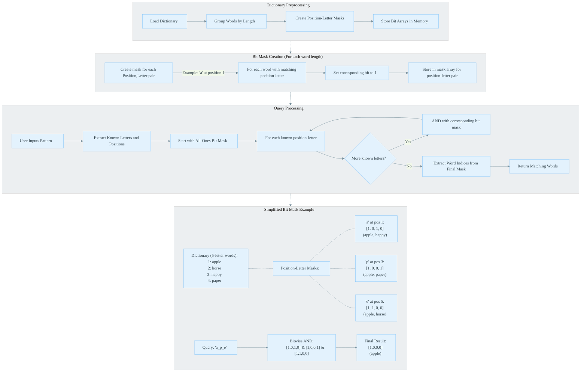

# Crossword Solver Algorithm Visualization

Below is a visual representation of the bit-masking algorithm used in the Crossword Solver.

## Algorithm Explanation

The diagram above illustrates the following key components of the crossword solver algorithm:

1. **Dictionary Preprocessing**
   - The dictionary is loaded and words are grouped by length
   - For each length, position, and letter combination, bit masks are created
   - Each bit in a mask represents a specific word in the dictionary

2. **Bit Mask Creation**
   - For each (position, letter) pair (e.g., 'a' at position 1)
   - Set the corresponding bit to 1 for each word that has that letter at that position
   - Store these bit masks for quick lookup during queries

3. **Query Processing**
   - When a user enters a pattern like "a_p_e"
   - Start with a mask of all 1s (representing all words as potential matches)
   - For each known letter position ('a' at position 1, 'p' at position 3, 'e' at position 5)
   - Perform a bitwise AND with the corresponding mask
   - After processing all known positions, the remaining 1 bits represent matching words

4. **Bit Manipulation Details**
   - Example showing how words like "apple" are represented in the bit masks
   - How combining masks with AND operations filters down to only matching words

This algorithm achieves O(k) time complexity where k is the number of known letters in the pattern, making it extremely efficient regardless of dictionary size.